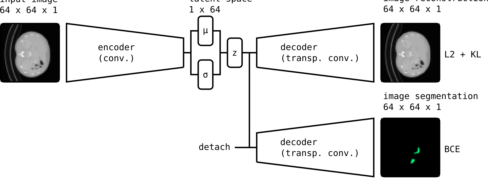

# VAE Pancreas Segmentation
Exploring a Variational Autoencoder (VAE) based Model for Pancreas Segmentation on the TCIA Pancreas-CT dataset.

## Dataset
The publicly accessible [dataset!](https://wiki.cancerimagingarchive.net/display/Public/Pancreas-CT#4d464781e8d04a3e935bc3007d9aed84s) of Pancreas-CT scans from the National Institute of Health Clinical Center comprises 82 3D CT scans, adding up to nearly 20,000 slices.
The dataset provides manually performed segmentations of the pancreas for each slice.

## Learning pancreas segmentations from CT scans
Image segmentation is an active research area in the field of medical imaging. The task is usually performed by medical doctors, but it is tedious and since it relies on pattern recognition, computational image analysis could be applied.

Machine learning models like neural networks can learn complex functions and generalize well, hence they are a popular choice for this task. Especially convolution-based networks are used for pattern recognition. A sequence of convolutional layers can learn a stack of filters that have a large perceptive field and can comprise information of large areas of the image.
A common architecture for image segmentation is the U-Net architecture[unet, use for image segmentation], which is basically a fully convolutional autoencoder style model that uses skip connections to pass through low-level information from encoder to decoder. While this approach yields good accuracy, the skip connections pass over low level information that might get lost in the autoencoded vector of the model, resulting in a limited generalization capability.
In this work I therefore do not use the U-Net architecture, but provide an alternative approach to the problem by using a Variational Autoencoder to learn a compact representation of the CT data in combination with a seperately trained decoder for the pancreas segmentation. First results on a downscaled version of the dataset (64 x 64) show that segmentation can indeed successfully be done by this method.

## Architecture
A Variational Autoencoder (VAE) compresses its inputs to a lower dimensional vector (latent space *z*) in an encoder and uses an decoder to reconstruct its input. In contrast to its predecessor it models the latent space as a gaussian distribution, resulting in a smooth representation.

In this approach a VAE is trained on the dataset by using a loss function combining the L2 distance for the reconstructions and the Kullback-Leibler divergence for latent space regularization (enforcing a gaussian).
A second decoder retreives the latent vector *z* and is trained on the segmentation labels by using Binary Cross-Entropy loss. Vector *z* is detached from the gradient calculations, hence the segmentation decoder does not influence the VAE encoder, but learns segmentation just from the latent space.

The encoder is constructed from a cascade of convolutional layers with kernel_size=4, stride=2 and padding=1 and a final dense layer. The decoder networks use a transposed version of the encoder architecture.

## Results

*Figure 1*: Evaluation of the trained model to a subset of the validation dataset. The top row shows the ground truth of the downsamled dataset. The scans are represented in grayscale and the superposed segmentations in green. The bottom row shows the reconstructions at a threshold of 0.2.

. images comparing ground truth and reconstructions (scans, segmentations)

## Outlook
i want to improve this by (lack of hardware right now):
. basicall improve latent space by: ...

. using full sized images to loose less information and get a better latent space representation
. applying an alternative encoder decoder model I already tested, but training takes more time.
. Using 3D convolutions or a recurrent model to make use of additional spatial information for an even better latent space
