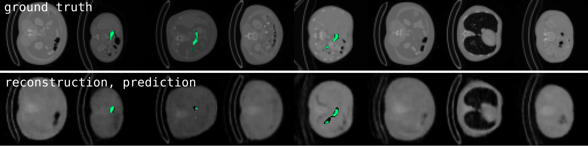

# VAE Pancreas Segmentation
Exploring a Variational Autoencoder (VAE) based Model for Pancreas Segmentation on the TCIA Pancreas-CT dataset.

## Dataset
The publicly accessible [dataset](https://wiki.cancerimagingarchive.net/display/Public/Pancreas-CT#4d464781e8d04a3e935bc3007d9aed84s) of Pancreas-CT scans from the National Institute of Health Clinical Center comprises 82 3D CT scans, adding up to nearly 20,000 slices.
The dataset provides manually performed segmentations of the pancreas for each slice.

## Learning pancreas segmentations from CT scans
Image segmentation is an active research area in the field of medical imaging. The task is usually performed by medical doctors, but it is tedious and since it relies on pattern recognition, computational image analysis could be applied.

Machine learning models like neural networks can learn complex functions and generalize well, especially convolution-based networks are used for pattern recognition. By stacking convolutional layers the perceptive fields is growing and information about large areas of the image can be gathered.
A common architecture for image segmentation is the U-Net architecture ([AskariHemmat et al., 2019](https://arxiv.org/abs/1908.01073); [Ronneberger et al., 2015](https://arxiv.org/abs/1505.04597)), which is basically a fully convolutional autoencoder style model that uses skip connections to pass through low-level information from encoder to decoder. This approach yields good accuracy, but since the skip connections pass over low level information from encoder to decoder this might lead to a loss of information in the latent space of the model and resulting in a limited generalization capability.

In this work I therefore do not use the U-Net architecture, but provide an alternative approach to the problem by using a Variational Autoencoder ([Kingma and Welling, 2014](https://arxiv.org/abs/1312.6114)) to learn a compact representation of the CT data in combination with a seperately trained decoder for the pancreas segmentation. First results on a downscaled version of the dataset (64 x 64) show that segmentation can indeed successfully be done by this method.

## Architecture
A Variational Autoencoder (VAE) compresses its inputs to a lower dimensional vector (latent space **z**) in an encoder and uses an decoder to reconstruct its input. In contrast to its predecessor it models the latent space as a gaussian distribution, resulting in a smooth representation.

**Figure 1**: Architecture for medical image segmentation. A basic VAE is trained on the dataset (top). A second decoder is trained on the latent space of the VAE to perform segmentation.

In this approach (Figure 1) a VAE is trained on the dataset by using a loss function combining the L2 distance for the reconstructions and the Kullback-Leibler divergence for latent space regularization (enforcing a gaussian).
A second decoder retreives the latent vector **z** and is trained on the segmentation labels by using Binary Cross-Entropy loss. Vector **z** is detached from the gradient calculations, hence the segmentation decoder does not influence the VAE encoder, but learns segmentation just from the latent space.

The encoder is constructed from a cascade of convolutional layers with kernel_size=4, stride=2 and padding=1 and a final dense layer, while the decoder networks use a transposed version of the encoder architecture.

## Results
The results of this approach are shown in figure 2.

**Figure 2**: Evaluation of the trained model to unseen data. The top row shows the ground truth of the downsampled dataset. The scans are represented in grayscale and the superposed segmentations in green. The bottom row shows the reconstructions and the predicted segmentations (probability threshold at 0.2).

## Outlook
To improve the reliability of this segmentation approach, the full scale dataset should be used for model training. Also I am testing an alternative encoder-, decoder-model of higher complexity, that still needs to be trained for a decent amount of time to be applicable.
But first and foremost the 3D nature of the dataset should be incorporated, which encodes additional information about the position of the pancreas. 3D convolutions or recurrent layers are two possibilities of approaching this issue.

## Tools
The [VAE Latent Space Viewer](https://github.com/paraficial/vae_latent_space_viewer) repository provides a simple tool for exploring the latent space of a trained model on this dataset.

## References
AskariHemmat, M., Honari, S., Rouhier, L., Perone, C.S., Cohen-Adad, J., Savaria, Y., David, J.-P., 2019. U-Net Fixed-Point Quantization for Medical Image Segmentation. arXiv:1908.01073 [cs, eess, stat].

Ronneberger, O., Fischer, P., Brox, T., 2015. U-Net: Convolutional Networks for Biomedical Image Segmentation. arXiv:1505.04597 [cs].

Kingma, D.P., Welling, M., 2014. Auto-Encoding Variational Bayes. arXiv:1312.6114 [cs, stat].

